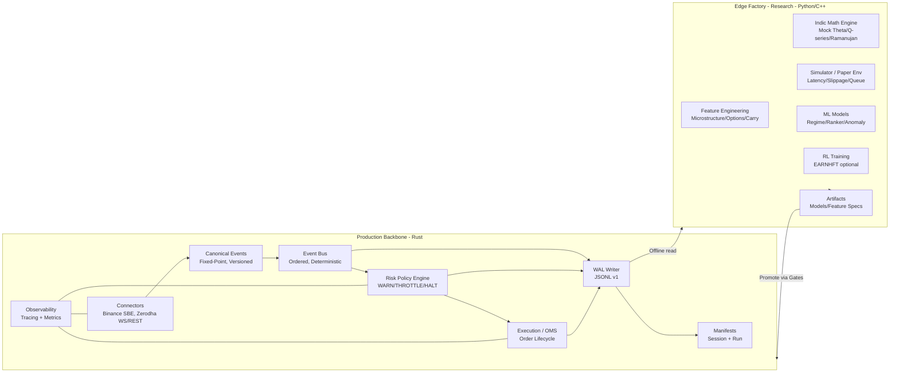
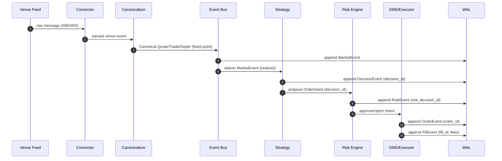
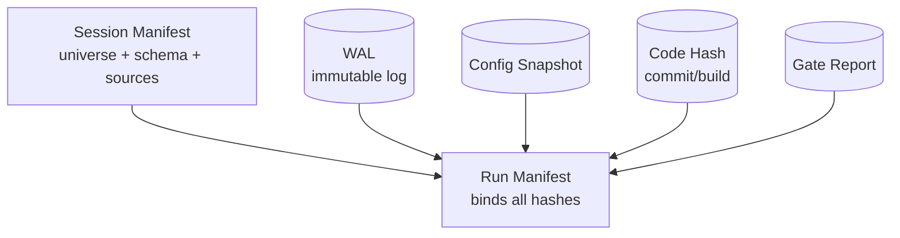
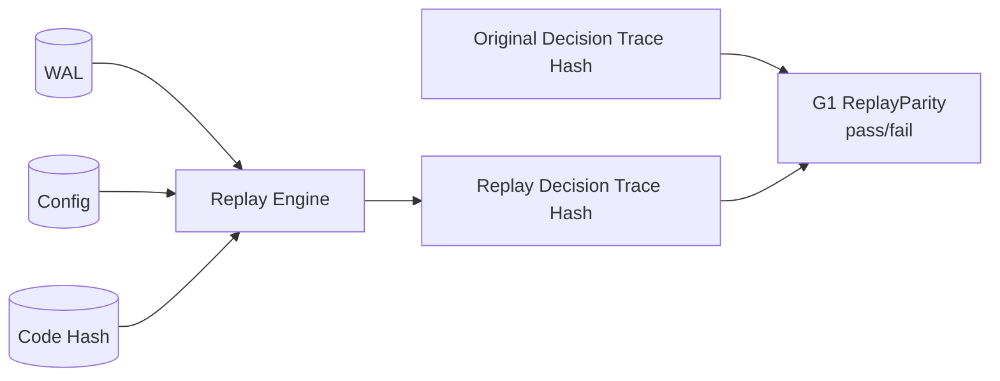
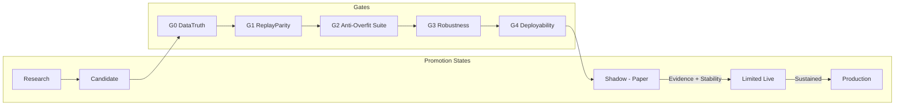
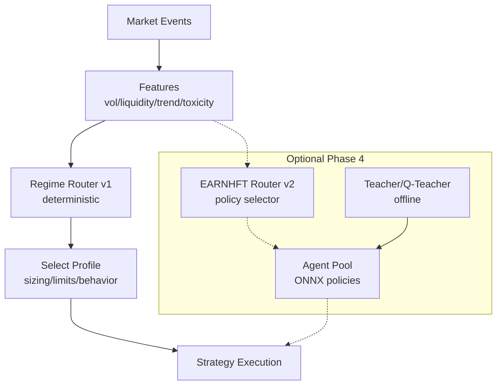
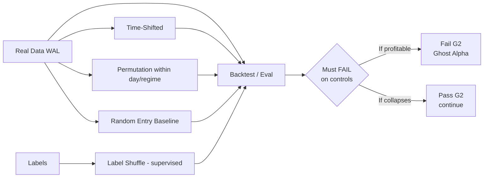
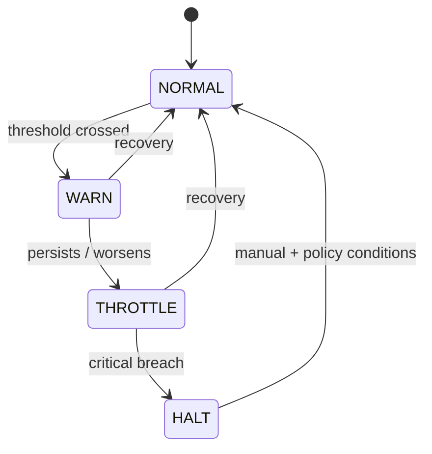

# QuantLaxmi Architecture Diagrams
## Event Flow, WAL/Replay Loop, Gates Pipeline, and Research Promotion

**Status:** Visual architecture reference aligned to Charter v2.1 and Production Contract.
**Format:** Mermaid diagrams suitable for Markdown rendering.

---

## 1) System Overview: Backbone + Edge Factory

---

## 2) Canonical Event Pipeline (Tick → Decision → Order → Fill)

---

## 3) WAL + Manifest Binding

---

## 4) Replay Loop and Replay Parity Gate (G1)

---

## 5) Gates Pipeline (G0–G4) and Promotion States

---

## 6) Regime Router v1 (Deterministic) → EARNHFT Router v2 Upgrade Path

---

## 7) Anti-Overfit Suite (G2) Concept Diagram

---

## 8) Risk Escalation Ladder (WARN → THROTTLE → HALT)

