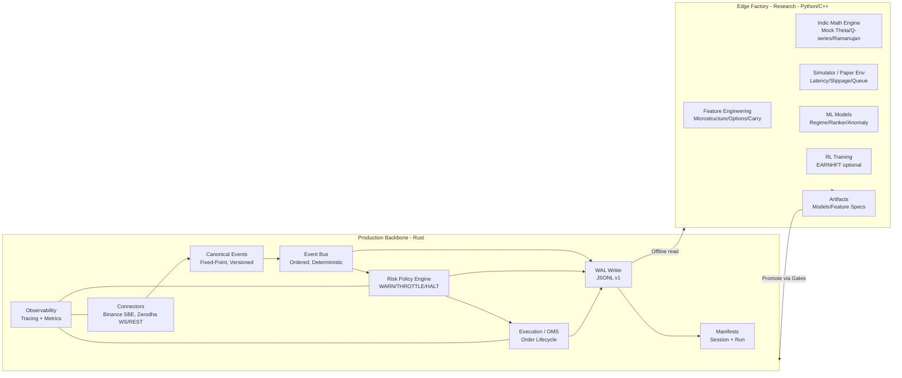
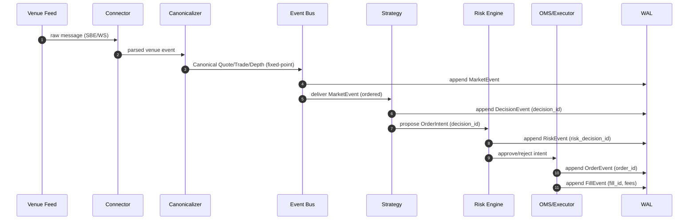
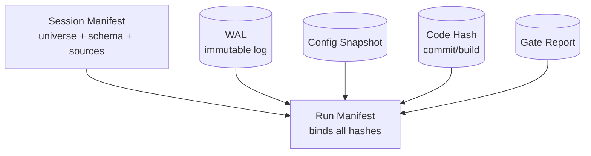
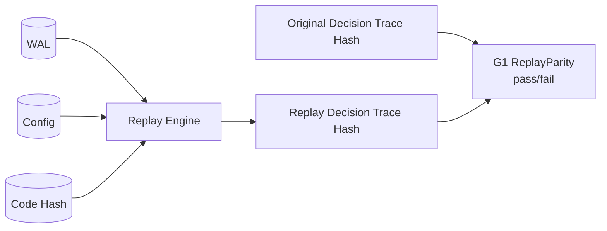
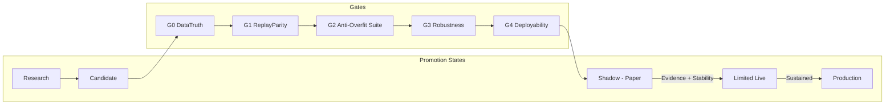
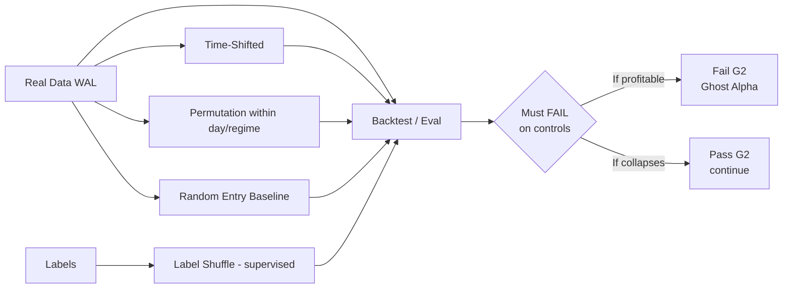
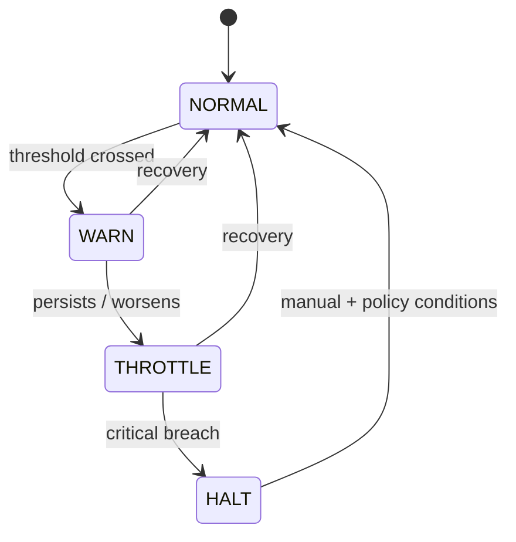

# QuantLaxmi Architecture Diagrams
## Event Flow, WAL/Replay Loop, Gates Pipeline, Capital Lifecycle, and Research Promotion

**Status:** Visual architecture reference aligned to Charter v2.2
**Last Updated:** 2026-01-27
**Format:** Mermaid diagrams + ASCII diagrams

---

## 1) System Overview: Backbone + Edge Factory



---

## 2) System Layer Architecture (Current State)

```
┌─────────────────────────────────────────────────────────────────────────────┐
│                           CAPITAL LAYER (Phase 13+)                         │
├─────────────────────────────────────────────────────────────────────────────┤
│                                                                             │
│  ┌─────────────────┐    ┌─────────────────┐    ┌─────────────────┐         │
│  │ Portfolio       │    │ Capital         │    │ Capital         │         │
│  │ Selector        │───►│ Allocation      │───►│ Execution       │         │
│  │ (13.2b NEXT)    │    │ (13.3 PENDING)  │    │ (FUTURE)        │         │
│  └────────▲────────┘    └─────────────────┘    └─────────────────┘         │
│           │                                                                 │
├───────────┼─────────────────────────────────────────────────────────────────┤
│           │              BUCKET LAYER (Phase 13.2a) ✅                      │
├───────────┼─────────────────────────────────────────────────────────────────┤
│           │                                                                 │
│  ┌────────┴────────┐    ┌─────────────────┐    ┌─────────────────┐         │
│  │ Bucket          │    │ Capital         │    │ Bucket          │         │
│  │ Registry        │───►│ Bucket          │───►│ Snapshot        │         │
│  │                 │    │                 │    │                 │         │
│  └────────▲────────┘    └─────────────────┘    └─────────────────┘         │
│           │                      │                                          │
│           │         ┌────────────┴────────────┐                            │
│           │         │ BucketEligibilityBinding │                            │
│           │         └────────────▲────────────┘                            │
│           │                      │                                          │
├───────────┼──────────────────────┼──────────────────────────────────────────┤
│           │              ELIGIBILITY LAYER (Phase 13.1) ✅                  │
├───────────┼──────────────────────┼──────────────────────────────────────────┤
│           │                      │                                          │
│  ┌────────┴────────┐    ┌────────┴────────┐    ┌─────────────────┐         │
│  │ Eligibility     │    │ Eligibility     │    │ Eligibility     │         │
│  │ Validator       │───►│ Decision        │───►│ Constraints     │         │
│  │                 │    │                 │    │                 │         │
│  └────────▲────────┘    └─────────────────┘    └─────────────────┘         │
│           │                                                                 │
├───────────┼─────────────────────────────────────────────────────────────────┤
│           │              PROMOTION LAYER (Phase 12.3) ✅                    │
├───────────┼─────────────────────────────────────────────────────────────────┤
│           │                                                                 │
│  ┌────────┴────────┐    ┌─────────────────┐    ┌─────────────────┐         │
│  │ Promotion       │    │ Promotion       │    │ Paper           │         │
│  │ Validator       │───►│ Decision        │◄───│ Evidence        │         │
│  │                 │    │                 │    │                 │         │
│  └────────▲────────┘    └─────────────────┘    └─────────────────┘         │
│           │                                                                 │
├───────────┼─────────────────────────────────────────────────────────────────┤
│           │              TOURNAMENT LAYER (Phase 12.2) ✅                   │
├───────────┼─────────────────────────────────────────────────────────────────┤
│           │                                                                 │
│  ┌────────┴────────┐    ┌─────────────────┐    ┌─────────────────┐         │
│  │ Tournament      │    │ Leaderboard     │    │ Attribution     │         │
│  │ Runner          │───►│ V1              │───►│ Summary         │         │
│  │                 │    │                 │    │                 │         │
│  └────────▲────────┘    └─────────────────┘    └─────────────────┘         │
│           │                                                                 │
├───────────┼─────────────────────────────────────────────────────────────────┤
│           │              STRATEGY LAYER (Phase 12.1) ✅                     │
├───────────┼─────────────────────────────────────────────────────────────────┤
│           │                                                                 │
│  ┌────────┴────────┐    ┌─────────────────┐    ┌─────────────────┐         │
│  │ Strategy        │    │ Strategy        │    │ Strategy        │         │
│  │ Registry        │───►│ Context         │───►│ Decision        │         │
│  │                 │    │                 │    │                 │         │
│  └────────▲────────┘    └─────────────────┘    └─────────────────┘         │
│           │                                                                 │
├───────────┼─────────────────────────────────────────────────────────────────┤
│           │              GATES LAYER (Phase 2) ✅                           │
├───────────┼─────────────────────────────────────────────────────────────────┤
│           │                                                                 │
│  ┌────────┴────────┐    ┌─────────────────┐    ┌─────────────────┐         │
│  │ G0 DataTruth    │    │ G2 Backtest     │    │ G4 Deploy       │         │
│  ├─────────────────┤    ├─────────────────┤    ├─────────────────┤         │
│  │ G1 Replay       │    │ G3 Robustness   │    │                 │         │
│  └─────────────────┘    └─────────────────┘    └─────────────────┘         │
│                                                                             │
├─────────────────────────────────────────────────────────────────────────────┤
│                           CORE LAYER (Phase 1) ✅                           │
├─────────────────────────────────────────────────────────────────────────────┤
│                                                                             │
│  ┌─────────────────┐    ┌─────────────────┐    ┌─────────────────┐         │
│  │ WAL             │    │ Replay          │    │ Events          │         │
│  │                 │    │ Engine          │    │ (Canonical)     │         │
│  └─────────────────┘    └─────────────────┘    └─────────────────┘         │
│                                                                             │
│  ┌─────────────────┐    ┌─────────────────┐    ┌─────────────────┐         │
│  │ Models          │    │ Connectors      │    │ Executor        │         │
│  │                 │    │ (Binance/Zerodha)│    │                 │         │
│  └─────────────────┘    └─────────────────┘    └─────────────────┘         │
│                                                                             │
└─────────────────────────────────────────────────────────────────────────────┘
```

---

## 3) Capital Lifecycle Flow

```
┌──────────────────────────────────────────────────────────────────────────────┐
│                           CAPITAL LIFECYCLE                                  │
└──────────────────────────────────────────────────────────────────────────────┘

  Tournament          Paper             Promotion         Eligibility
  Selection           Evidence          Decision          Decision
      │                  │                  │                  │
      ▼                  ▼                  ▼                  ▼
  ┌───────┐         ┌───────┐         ┌───────┐         ┌───────┐
  │Rank by│         │Collect│         │Enforce│         │Check  │
  │Alpha  │────────►│Paper  │────────►│"No G3 │────────►│Metrics│
  │Score  │         │Trades │         │w/o    │         │Thresh-│
  │       │         │       │         │Paper" │         │olds   │
  └───────┘         └───────┘         └───────┘         └───────┘
      │                  │                  │                  │
      │ LeaderboardV1    │ PaperEvidence    │ PromotionDecision│ EligibilityDecision
      ▼                  ▼                  ▼                  ▼
  ┌───────┐         ┌───────┐         ┌───────┐         ┌───────┐
  │SHA-256│         │SHA-256│         │SHA-256│         │SHA-256│
  │Digest │         │Digest │         │Digest │         │Digest │
  └───────┘         └───────┘         └───────┘         └───────┘
                                                              │
                                                              ▼
  ┌───────┐         ┌───────┐         ┌───────┐         ┌───────┐
  │Capital│         │Bucket │         │Bucket │         │Bucket │
  │Bucket │◄────────│Binding│◄────────│Binding│◄────────│Snapshot│
  │       │         │       │         │Decision│         │       │
  └───────┘         └───────┘         └───────┘         └───────┘
      │                  │                  │                  │
      │ CapitalBucket    │ BucketEligibility│ BucketBinding   │ BucketSnapshot
      ▼                  ▼    Binding       ▼   Decision      ▼
  ┌───────┐         ┌───────┐         ┌───────┐         ┌───────┐
  │Venue  │         │Strategy│         │SHA-256│         │SHA-256│
  │Isolated│         │Bound  │         │Digest │         │Digest │
  └───────┘         └───────┘         └───────┘         └───────┘
                                                              │
                                                              ▼
                                                    ┌─────────────────┐
                                                    │ PORTFOLIO       │
                                                    │ SELECTOR        │
                                                    │ (Phase 13.2b)   │
                                                    └─────────────────┘
```

---

## 4) Venue Isolation Model

```
┌─────────────────────────────────────────────────────────────────────────────┐
│                           VENUE ISOLATION                                   │
└─────────────────────────────────────────────────────────────────────────────┘

                    ┌──────────────────────────────────────┐
                    │         BucketRegistry               │
                    └──────────────────────────────────────┘
                                      │
          ┌───────────────────────────┼───────────────────────────┐
          │                           │                           │
          ▼                           ▼                           ▼
  ┌───────────────┐         ┌───────────────┐         ┌───────────────┐
  │   CRYPTO      │         │   INDIA       │         │   PAPER       │
  │   VENUE       │         │   VENUE       │         │   VENUE       │
  └───────────────┘         └───────────────┘         └───────────────┘
          │                           │                           │
    ┌─────┴─────┐               ┌─────┴─────┐                     │
    │           │               │           │                     │
    ▼           ▼               ▼           ▼                     ▼
┌───────┐   ┌───────┐       ┌───────┐   ┌───────┐           ┌───────┐
│Binance│   │Binance│       │  NSE  │   │  NSE  │           │ Any   │
│ Perp  │   │ Spot  │       │Futures│   │Options│           │Simula-│
│(USDT) │   │(USDT) │       │ (INR) │   │ (INR) │           │ tion  │
└───────┘   └───────┘       └───────┘   └───────┘           └───────┘
    │           │               │           │                   │
    │    ██████████████████████████████████████████████████     │
    │    █                                                █     │
    │    █  ISOLATION BOUNDARY: No cross-venue capital    █     │
    │    █  flow without explicit bridge (future phase)   █     │
    │    █                                                █     │
    │    ██████████████████████████████████████████████████     │
    │                                                           │
    ▼                                                           ▼
┌─────────────────────────────────────────────────────────────────┐
│  Each bucket enforces:                                          │
│  - Single venue                                                 │
│  - Single currency                                              │
│  - Explicit constraints (max notional, max strategies, etc.)    │
│  - Risk class declaration                                       │
└─────────────────────────────────────────────────────────────────┘
```

---

## 5) Canonical Event Pipeline (Tick → Decision → Order → Fill)



---

## 6) WAL + Manifest Binding



---

## 7) Replay Loop and Replay Parity Gate (G1)



---

## 8) Gates Pipeline (G0–G4) and Promotion States



---

## 9) Decision Artifact Chain

```
┌─────────────────────────────────────────────────────────────────────────────┐
│                    DECISION ARTIFACT CHAIN (All SHA-256 Hashed)             │
└─────────────────────────────────────────────────────────────────────────────┘

┌─────────────┐    ┌─────────────┐    ┌─────────────┐    ┌─────────────┐
│ Tournament  │    │ Promotion   │    │ Eligibility │    │ Bucket      │
│ Manifest    │───►│ Decision    │───►│ Decision    │───►│ Binding     │
│             │    │             │    │             │    │ Decision    │
├─────────────┤    ├─────────────┤    ├─────────────┤    ├─────────────┤
│strategy_id  │    │strategy_id  │    │strategy_id  │    │bucket_id    │
│rank         │    │accepted     │    │status       │    │strategy_id  │
│alpha_score  │    │reasons[]    │    │checks[]     │    │accepted     │
│digest ──────┼───►│digest ──────┼───►│digest ──────┼───►│digest       │
└─────────────┘    └─────────────┘    └─────────────┘    └─────────────┘
       │                  │                  │                  │
       ▼                  ▼                  ▼                  ▼
   Immutable          Immutable          Immutable          Immutable
   Artifact           Artifact           Artifact           Artifact

                              │
                              ▼
                    ┌─────────────────┐
                    │ Bucket          │
                    │ Snapshot        │
                    ├─────────────────┤
                    │ buckets[]       │
                    │ bindings[]      │
                    │ digest          │
                    │ taken_at        │
                    └─────────────────┘
                              │
                              ▼
                         Immutable
                         Audit Trail
```

---

## 10) Anti-Overfit Suite (G2) Concept Diagram



---

## 11) Risk Escalation Ladder (WARN → THROTTLE → HALT)



---

## 12) Test Coverage Map

```
┌─────────────────────────────────────────────────────────────────────────────┐
│                           TEST COVERAGE BY LAYER                            │
└─────────────────────────────────────────────────────────────────────────────┘

Layer                    Tests    Coverage Focus
─────────────────────────────────────────────────────────────────────────────
Capital Buckets          13       Venue isolation, binding, snapshots
Capital Eligibility      13       Invariants, policy presets, digests
Promotion                8        Paper evidence requirement, gates
Tournament               10+      Ranking, determinism, manifests
Strategy SDK             39       Registry, context, decisions
Gates (G0-G4)            20+      Validation, replay parity
Models                   57       Schemas, serialization
Runner-Crypto            52       Backtest, paper, integration
─────────────────────────────────────────────────────────────────────────────
TOTAL                    280+     Full workspace passing
```

---

*End of Architecture Diagrams*
